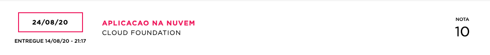

# FIAP Cloud

  

  
  
  

  

  

Projeto para conclusão da disciplina de Cloud Foundation, ministrada em agosto de 2020

As descriçãoes e tutoriais referentes a cada projeto estão em:
- [Tutorial front-end](https://github.com/Relirk/fiap-cloud/tree/master/frontend)
- [Tutorial back-end](https://github.com/Relirk/fiap-cloud/tree/master/backend)

Resultado do professor avaliador + banca

