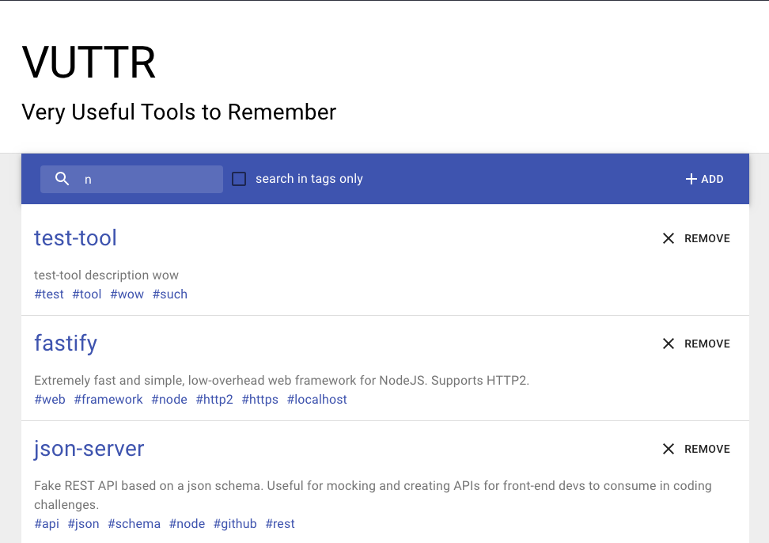

# VUTTR (Frontend)

  

  
  
  

  

  

Este repositório contém uma simples interface front-end para o desafio de front-end do BossaBox.
- Em conjunto com a api a interface é completamente funcional.

Tecnologias utilizadas:
* [ReactJS](https://reactjs.org/)
* [Material-UI](https://material-ui.com/)
* [Yarn](https://yarnpkg.com/)

## Como executar
- Faça o clone/download deste repositório;
- Garanta que sua [api](https://gitlab.com/bossabox/challenge-fake-api/tree/master) esteja rodando na porta 3000;
- Execute `yarn install` e `yarn start`. A interface fica localizada em `http://localhost:3001`.

## Recursos
Esta interface tem implementado as seguintes rotas da api:

* `GET /tools` : lista as ferramentas cadastradas
* `POST /tools` : cria uma nova ferramenta
* `DELETE /tools/:id` : apaga a ferramenta com ID :id
* Em `GET /tools` fazer uma busca global utilizando a query string `?q=:busca`;
* Em `GET /tools` fazer uma busca por tags individuais utilizando a query string `?tags_like=:busca`.

